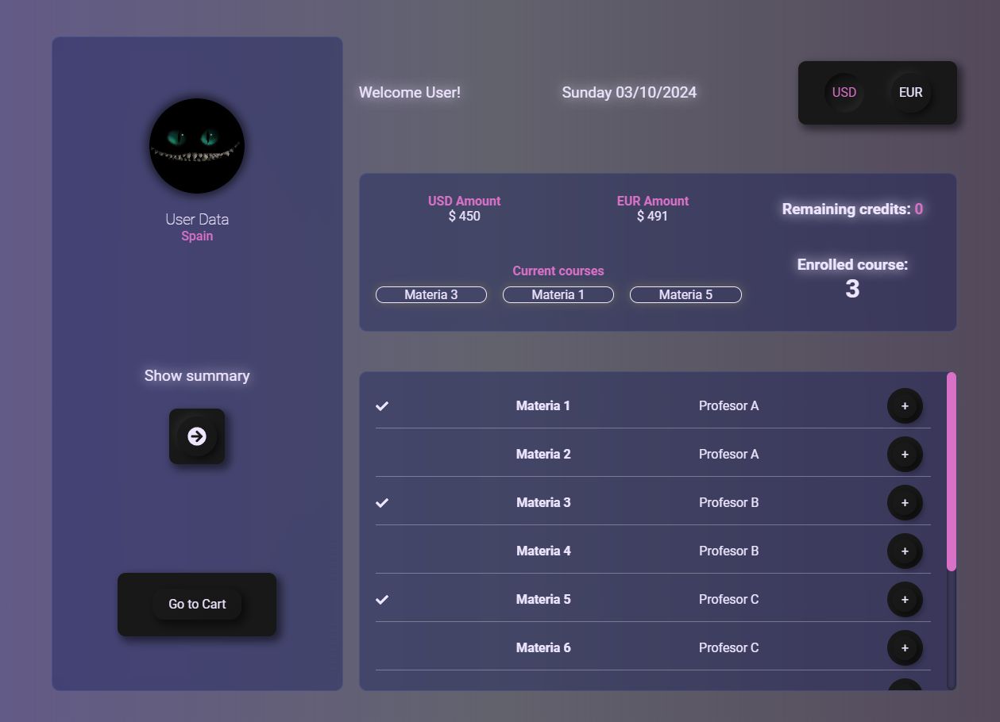

# Proyecto: Aplicación de lista de tareas

Dashboard encargado de visualizar interface para inscripcion de cursos.

## Configuración y despliegue

1. Asegúrate de tener Node.js y npm instalados en tu computadora.
2. Descarga o clona el repositorio en tu computadora.
3. En la carpeta del proyecto, ejecuta el comando `npm install` para instalar todas las dependencias.
4. Ejecuta el comando `npm start` para iniciar la aplicación en modo desarrollo.
5. Accede a la aplicación en modo desarrollo en tu navegador en la dirección: `http://localhost:3000/` o accede a la aplicacion desplegada [aqui](pendiente)

## Librerias

Este proyecto utiliza las siguientes librerías:

- <b>react-icons</b>: Libreria de iconos
- <b>react-router-dom</b>: Enrutamiento
- <b>sass</b>: Preprocesador
- <b>typescript</b>: Tipado estricto

## Uso de la aplicación

- Registrate (login)
- Puedes elegir 3 cursos diferentes. No puedes elegir un cursos con el mismo profesor.
- Para agregar cada curso dar click en el boton de + en cualquiera de las filas.
- Puedes visualizar los detalles del cursos dando click en "Show summary".
- El boton para eliminar cursos se encuentra habilitado hasta que se confirme los cursos elegidos.
- Puedes acceder al boton de eliminar en la vista de "Show summary".
- Una vez hayas confirmado los cursos inscritos, el boton de eliminar cursos desaparecera.
- El boton de "Confirm courses", se habilita unicamente cuando se han elegido 3 cursos.
- Una vez se ha confirmado los cursos, el boton de "Confirm courses" cambiara por "Go to Cart".
- Una vez se han confirmado los cursos es posible visualizar los estudiantes inscritos dando click en caulquiera de los botones de Current courses.
- Unicamente es posible visualizar los estudiantes inscritos en cada curso, cuando se han confirmado los cursos inscritos.
- En la card de la derecha es posible visualizar los cursos incritos y los creditos restantes.

## Screenshots

### Desktop

## Licencia

Este proyecto está licenciado bajo la licencia MIT.

## Contacto

Si tienes preguntas o problemas con el proyecto, contáctame en [click aqui](mailto:danielmark999@gmail.com)

## Contribuidores

- [Github de Daniel](https://github.com/BNAStudio)

## Recursos

- [Repositorio](https://github.com/BNAStudio/app_inter.git)
- [Deploy](pendiente)